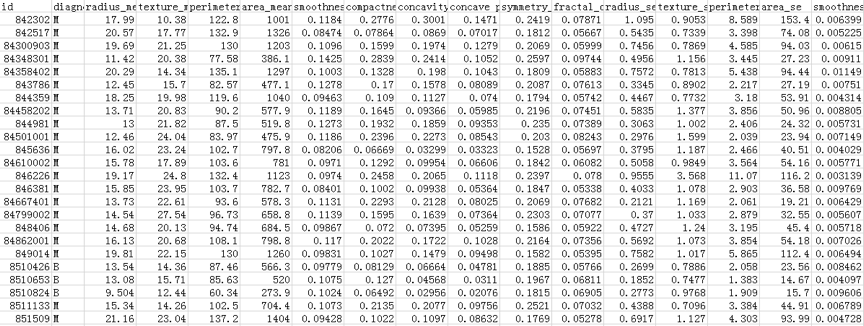

# 使用leteasyAi进行支持向量机SVM预测分析

## 1. 引言
SVM 的中文叫支持向量机，英文是 Support Vector Machine，简称 SVM。它是常见的一种分类方法，在机器学习中，SVM 是有监督的学习模型。

什么是有监督的学习模型呢？它指的是我们需要事先对数据打上分类标签，这样机器就知道这个数据属于哪个分类。同样无监督学习，就是数据没有被打上分类标签，这可能是因为我们不具备先验的知识，或者打标签的成本很高。所以我们需要机器代我们部分完成这个工作，比如将数据进行聚类，方便后续人工对每个类进行分析。SVM 作为有监督的学习模型，通常可以帮我们模式识别、分类以及回归分析。

## 2. 实战使用

在以往的工作和学习手册中都会讲很多理论，因为ChatGPT + Code Interpreter的出现，大大简化了需要的代码知识，这里我们跳过理论部分，直接使用ChatGPT数据分析模型（这里使用的是GPT3.5 turbo的模型），一步步演示:


数据集来自美国威斯康星州的乳腺癌诊断[数据集](./data/svm_data.csv),医疗人员采集了患者乳腺肿块经过细针穿刺 (FNA) 后的数字化图像，并且对这些数字图像进行了特征提取，这些特征可以描述图像中的细胞核呈现。肿瘤可以分成良性和恶性。部分数据截屏如下所示：



数据表一共包括了 32 个字段，代表的含义如下：

| 字段                   | 含义                                           |
|------------------------|------------------------------------------------|
| ID                     | ID标识                                         |
| diagnosis              | M/B (M:恶性, B:良性)                           |
| radius_mean            | 半径(点中心到边缘的距离)平均值                 |
| texture_mean           | 文理(灰度值的标准差)平均值                     |
| perimeter_mean         | 周长平均值                                     |
| area_mean              | 面积平均值                                     |
| smoothness_mean        | 平滑程度(半径内的局部变化)平均值               |
| compactness_mean       | 紧密度(=周长*周长/面积-1.0)平均值             |
| concavity_mean         | 凹度(轮廓凹部的严重程度)平均值                 |
| concave points_mean    | 凹缝(轮廓的凹部分)平均值                       |
| symmetry_mean          | 对称性平均值                                   |
| fractal_dimension_mean | 分形维数(=海岸线近似-1)平均值                  |
| radius_se              | 半径(点中心到边缘的距离)标准差                 |
| texture_se             | 文理(灰度值的标准差)标准差                     |
| perimeter_se           | 周长标准差                                     |
| area_se                | 面积标准差                                     |
| smoothness_se          | 平滑程度(半径内的局部变化)标准差               |
| compactness_se         | 紧密度(=周长*周长/面积-1.0)标准差             |
| concavity_se           | 凹度(轮廓凹部的严重程度)标准差                 |
| concave points_se      | 凹缝(轮廓的凹部分)标准差                       |
| symmetry_se            | 对称性标准差                                   |
| fractal_dimension_se   | 分形维数(=海岸线近似-1)标准差                  |
| radius_worst           | 半径(点中心到边缘的距离)最大值                 |
| texture_worst          | 文理(灰度值的标准差)最大值                     |
| perimeter_worst        | 周长最大值                                     |
| area_worst             | 面积最大值                                     |
| smoothness_worst       | 平滑程度(半径内的局部变化)最大值               |
| compactness_worst      | 紧密度(=周长*周长/面积-1.0)最大值             |
| concavity_worst        | 凹度(轮廓凹部的严重程度)最大值                 |
| concave points_worst   | 凹缝(轮廓的凹部分)最大值                       |
| symmetry_worst         | 对称性最大值                                   |
| fractal_dimension_worst| 分形维数(=海岸线近似-1)最大值                  |

上面的表格中，mean 代表平均值，se 代表标准差，worst 代表最大值（3 个最大值的平均值）。每张图像都计算了相应的特征，得出了这 30 个特征值（不包括 ID 字段和分类标识结果字段 diagnosis），实际上是 10 个特征值（radius、texture、perimeter、area、smoothness、compactness、concavity、concave points、symmetry 和 fractal_dimension_mean）的 3 个维度，平均、标准差和最大值。这些特征值都保留了 4 位数字。字段中没有缺失的值。在 569 个患者中，一共有 357 个是良性，212 个是恶性。

我们的目标是生成一个乳腺癌诊断的 SVM 分类器，并计算这个分类器的准确率。首先设定项目的执行流程：


### 2.1. 首先我们需要加载数据源；

点击左下角上传图标，选中上传的文件之后，发送：这个是 来自美国威斯康星州的乳腺癌诊断数据集，帮忙分析下这个数据（其中:文件:file-qAuwCL99xP9i420VMxCdxlcT的文件名称为:data.csv扩展名为: csv **这一句是系统加的，方便后续GPT读取文件，可以忽略**）


### 2.2. 查看样本特征和特征值

> 在准备阶段，需要对加载的数据源进行探索，查看样本特征和特征值，这个过程你也可以使用数据可视化，它可以方便我们对数据及数据之间的关系进一步加深了解。然后按照“完全合一”的准则来评估数据的质量，如果数据质量不高就需要做数据清洗。数据清洗之后，你可以做特征选择，方便后续的模型训练；

```python
Index(['id', 'diagnosis', 'radius_mean', 'texture_mean', 'perimeter_mean',
       'area_mean', 'smoothness_mean', 'compactness_mean', 'concavity_mean',
       'concave points_mean', 'symmetry_mean', 'fractal_dimension_mean',
       'radius_se', 'texture_se', 'perimeter_se', 'area_se', 'smoothness_se',
       'compactness_se', 'concavity_se', 'concave points_se', 'symmetry_se',
       'fractal_dimension_se', 'radius_worst', 'texture_worst',
       'perimeter_worst', 'area_worst', 'smoothness_worst',
       'compactness_worst', 'concavity_worst', 'concave points_worst',
       'symmetry_worst', 'fractal_dimension_worst'],
      dtype='object')
         id diagnosis  radius_mean  texture_mean  perimeter_mean  area_mean  \
0    842302         M        17.99         10.38          122.80     1001.0   
1    842517         M        20.57         17.77          132.90     1326.0   
2  84300903         M        19.69         21.25          130.00     1203.0   
3  84348301         M        11.42         20.38           77.58      386.1   
4  84358402         M        20.29         14.34          135.10     1297.0 
```


这里在运行结果中，你能看到 32 个字段里，id 是没有实际含义的，可以去掉。diagnosis 字段的取值为 B 或者 M，我们可以用 0 和 1 来替代。另外其余的 30 个字段，其实可以分成三组字段，下划线后面的 mean、se 和 worst 代表了每组字段不同的度量方式，分别是平均值、标准差和最大值，把这句话复制到对话框，接下来我们让chatGPT帮我们简单处理数据：


然后我们要做特征字段的筛选，首先需要观察下 features_mean 各变量之间的关系，这里我们可以用 DataFrame 的 corr() 函数，然后用热力图帮我们可视化呈现。同样，我们也会看整体良性、恶性肿瘤的诊断情况，可以看到 chatGPT 很快就帮我们把图画了出来：


这是运行的结果：


>以上就是 features_mean 中各个变量之间的相关性热力图。从热力图中可以看出，不同变量之间的相关性程度。相关系数的取值范围为 -1 到 1，具体含义为：  
>- 当相关系数接近 1 时，表示变量之间存在强正相关。
>- 当相关系数接近 -1 时，表示变量之间存在强负相关。
>- 当相关系数接近 0 时，表示变量之间不存在线性相关性。  
>基于热力图，您可以清晰地看出 features_mean 中各个变量之间的相关性，这可以帮助我们理解数据中特征之间的关系以及对后续特征选择和建模工作产生指导。如果需要进一步讨论相关内容或者进行其他分析，欢迎随时告诉我。

热力图中对角线上的为单变量自身的相关系数是 1。颜色越浅代表相关性越大。所以你能看出来 radius_mean、perimeter_mean 和 area_mean 相关性非常大，compactness_mean、concavity_mean、concave_points_mean 这三个字段也是相关的。因此我们建议取其中的一个作为代表，接下来我们看下chatGPT的操作：


可以看出，ChatGPT也根据相关性直接选出了正确的特征属性，我们只需要根据所需要的目的直接安排任务即刻。

### 2.3. 使用 SVM 分类器

对特征进行选择之后，我们就可以准备训练集和测试集:


并给出相关的代码；

```python
from sklearn.model_selection import train_test_split
from sklearn.svm import SVC
from sklearn.preprocessing import StandardScaler
from sklearn.metrics import accuracy_score

# 选择部分特征
selected_features = ['radius_mean', 'perimeter_mean', 'area_mean', 'compactness_mean', 'concavity_mean', 'concave points_mean']

# 提取特征和目标变量
X = cancer_data[selected_features]
y = cancer_data['diagnosis']

# 数据预处理：特征缩放
scaler = StandardScaler()
X = scaler.fit_transform(X)

# 划分训练集和测试集
X_train, X_test, y_train, y_test = train_test_split(X, y, test_size=0.3, random_state=42)

# 训练SVM模型
svm_model = SVC(kernel='rbf', random_state=42)
svm_model.fit(X_train, y_train)

# 预测
y_pred = svm_model.predict(X_test)

# 计算准确率
accuracy = accuracy_score(y_test, y_pred)
accuracy
```

> 使用选定的高相关性特征进行了 SVM 模型训练，并且在测试集上取得了约 92.98% 的准确率。这意味着模型对这些特征进行了很好的学习，并且能够有效地进行预测。

准确率大于 90%，说明训练结果还不错。

## 3. 相关不足

虽然ChatGPT的Code Interpreter在数据分析方面有革命性的影响，但是还存在诸多限制：

* 需要Plus账号。Code Interpreter这个OpenAI自研的功能目前只对Plus会员开放，势必会影响它的大规模普及。而且就算有Plus账号的话，每三个小时50条会话的限制对于一些大型的项目使用起来不太方便。
* 无法联网。Code Interpreter用来进行分析的Python库都是内置在沙盒环境中的，一些没有内置的库无法通过联网下载。而且如果你要分析的话题比较新，那么ChatGPT由于缺乏实时的知识，可能会不了解你的项目，从而影响判断的准确性。
* 国内无法使用。ChatGPT在国内是无法直接访问的，需要搭梯子，很多小伙伴搭梯子的时间都够做两次数据分析了。（推荐使用leteasyAi进行数据分析，代理的服务器）
* 不稳定。目前它对你上传的数据所记忆的时间是有限制的，超过了时间限制你可能需要重新上传数据。由于模型本身的随机性，每次它的分析方法可能有差异。
* 缺少一些中文支持。在数据分析过程中，最好还是用英文来对话，否则可能会显示不正常或者分析的能力会不如英文环境。
* 机器学习能力不足。对于常规的数据分析，Code Interpreter是没有问题的，但是如果涉及复杂的机器学习建模，它就有些吃力了。

## 4. 个人感受

曾几何时，很多小伙伴拿到宝贵的一手数据，却不知道如何分析。在几年前，你会看到很多不同学科的人一窝蜂跑去学习 Python。因为在彼时，只有学会了 Python 或者 R 后，你才可能对数据进行功能丰富且合理可行的分析。很多人因为不具备相关的技术能力，往往坐拥金山，但就是不知道怎么挖掘。

Code Interpreter让我们仅仅通过对话就能分析庞大而复杂的数据。我们更需要关注的是如果指导这些人工智能工具为我们处理复杂而繁重的工作，而不是写代码本身。

尽管Code Interpreter目前存在一些限制，但它无疑是一个强大的工具。随着它的不断迭代，这些限制应该也会越来越少。代码解释器让我们离每个人都可以成为数据分析师的未来又近了一步。

## 相关引用

> [如何进行乳腺癌检测](https://time.geekbang.org/column/article/80712?utm_campaign=geektime_search&utm_content=geektime_search&utm_medium=geektime_search&utm_source=geektime_search&utm_term=geektime_search)  
> [leteasyAi数据分析助理](http://47.109.94.3/#/)